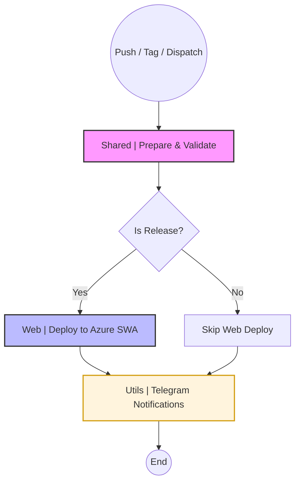

# App Pipeline - CI/CD Documentation (Web Only)

Este repositório utiliza uma arquitetura modular de workflows do GitHub Actions para gerenciar o ciclo de vida de desenvolvimento, build e deploy da aplicação Web.

## 📁 Estrutura de Arquivos

```
.github/workflows/
├── pipeline.yml               # 🎯 Workflow principal (orquestrador)
├── prepare.yml                # 🔧 Preparação e validação common (lint, deps)
├── deploy-web.yml             # 📂 Deploy para Azure Static Web Apps
└── notify.yml                 # 🔔 Notificações consolidadas (Telegram)
```

## 📊 Fluxo de Trabalho (Pipeline)

O diagrama abaixo ilustra como os jobs estão orquestrados:



## 🎯 Workflow Principal: `pipeline.yml`

**Responsabilidade**: Orquestrar todos os estágios (Web, Notificações).

**Gatilhos**:
- Push em tags `v*.*.*` (Gera Deploy Web Release)
- Push em branches `main`, `develop` (Gera Deploy Web + Validação)
- Pull requests (Apenas validação)
- Execução Manual (Workflow Dispatch)

---

## 🔧 Detalhes dos Componentes

### 1. `prepare.yml` (Common)
Executa tarefas básicas:
- Instalação de dependências (`bun install`).
- Determinação do tipo de build (`debug` ou `release`).

### 2. `deploy-web.yml` (Web)
Responsável por publicar a aplicação no **Azure Static Web Apps**.
- Executa apenas em builds de **release**.
- Utiliza a action oficial da Microsoft para o deploy.
- **Requisito**: Secret `AZURE_STATIC_WEB_APPS_API_TOKEN`.

### 3. `notify.yml` (Utils)
Consolida os resultados de todos os jobs anteriores e envia uma única mensagem formatada para o Telegram, informando o status da Web.

---

## 🔐 Secrets Necessários

Configure em: **Settings → Secrets and variables → Actions**

### Azure (Web)
- `AZURE_STATIC_WEB_APPS_API_TOKEN`: Token de implantação do Azure SWA.

### Notificações
- `TELEGRAM_BOT_TOKEN`
- `TELEGRAM_CHAT_ID`

---

## 🎨 Benefícios desta Estrutura
- **Isolamento**: Workflows modulares facilitam a manutenção.
- **Economia**: O build web e linting são feitos uma única vez no início.
- **Visibilidade**: Notificações ricas no Telegram com status de cada frente de trabalho.

---
**Última atualização**: 2026-01-26
**Versão**: 3.1.0 (Web Only Pipeline)
